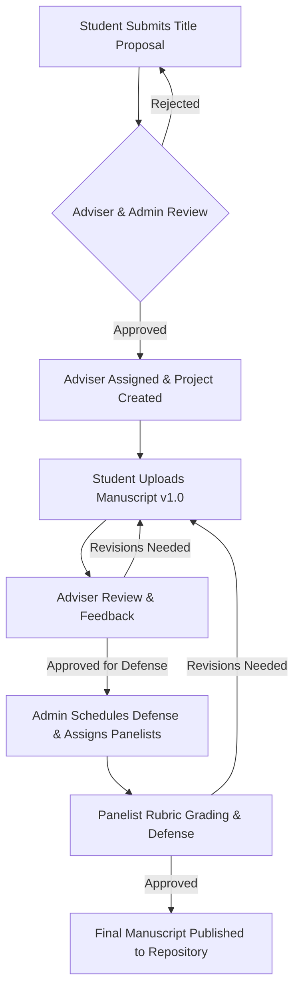
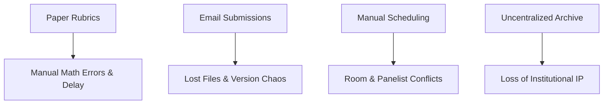

# Product Requirements Document (PRD)
## CoreResearch: University Student Research Management System

---

## 1. Executive Summary

**CoreResearch** is an enterprise-grade, web-based Student Research Management System engineered specifically for higher education institutions. The platform digitizes and unifies the end-to-end undergraduate and graduate research lifecycle—from initial title proposal submission, adviser assignment, and manuscript version control, through defense scheduling, multi-panelist rubric grading, and public/institutional repository archiving.

By replacing manual, fragmented, paper-based workflows with a role-governed digital ecosystem, CoreResearch eliminates operational bottlenecks, enhances transparency between students and faculty, ensures institutional compliance, and preserves valuable academic intellectual property.

---

## 2. Product Vision

To become the standard digital operating system for academic research governance in universities worldwide—empowering students and academic staff with seamless collaboration tools while safeguarding academic integrity and institutional research output.

---

## 3. Product Mission

To streamline research governance by providing an intuitive, centralized, and role-secured web platform that accelerates manuscript reviews, simplifies defense logistics, automates grade calculations, and publishes institutional research efficiently.

---

## 4. Problem Statement

University academic research administration is severely hindered by inefficient, paper-driven, and decentralized communication channels:

* **Fragmented Communication**: File exchanges and feedback occur via unorganized email threads, instant messages, or hard copies, leading to lost feedback and version confusion.
* **Lack of Progress Transparency**: Students and department administrators lack real-time visibility into proposal approval statuses, review delays, and defense readiness.
* **Manual Defense & Grading Overhead**: Defense scheduling causes severe scheduling conflicts. Tabulating scores across multiple panelists using paper rubrics is error-prone and time-consuming.
* **Loss of Intellectual Property**: Approved research papers are stored in physical filing cabinets or static local drives, preventing institutional searchability and knowledge sharing.

---

## 5. Proposed Solution

CoreResearch introduces a centralized, cloud-enabled web application built on Node.js/Express.js, React, and Firebase Firestore/Auth/Storage. Key solutions provided include:

1. **Role-Tailored Workspaces**: Dedicated, clean dashboards customized for Students, Advisers, Panelists, and Administrators.
2. **Title & Manuscript Lifecycle Management**: Structured proposal submission, version-controlled file storage (`v1.0`, `v1.1`, `v2.0`), and change history tracking.
3. **Integrated Feedback & Revisions**: Threaded review comments linked to specific manuscript versions with actionable status flags (Approved, Revisions Required, Rejected).
4. **Automated Defense & Grading Engine**: Digital rubric forms with auto-tabulation of weighted panel scores and instant final grade generation.
5. **Institutional Digital Repository**: Searchable library of approved research papers with full-text keyword indexing and downloadable manuscripts.



---

## 6. Target Users

| Role | Description | Primary Responsibilities |
| :--- | :--- | :--- |
| **Student** | Undergraduate or graduate student conducting research. | Submit title proposals, upload manuscript versions, respond to feedback, view schedules & grades. |
| **Adviser** | Faculty member mentoring and guiding student research teams. | Review proposals, annotate manuscripts, approve defense readiness, track student progress. |
| **Panelist** | Faculty member serving on defense evaluation committees. | Review manuscripts pre-defense, attend defense presentations, fill digital rubrics, submit grades. |
| **Administrator** | Department Chair, Research Coordinator, or System Admin. | Manage user accounts, approve title proposals, assign advisers/panelists, schedule defenses, publish papers. |

---

## 7. User Personas

### Persona 1: Alex Rivera (Student)
* **Demographics**: Senior Computer Science Student, 22 years old.
* **Goals**: Submit research proposals easily, track adviser feedback in one place, know defense dates early.
* **Pain Points**: Frustrated when email attachments get lost, confused about which manuscript file is the latest (`Final_v2_final_FIXED.docx`).

### Persona 2: Dr. Eleanor Vance (Adviser & Panelist)
* **Demographics**: Associate Professor & Research Adviser, 45 years old.
* **Goals**: Manage 8 student research groups efficiently without drowning in emails; provide clear structured feedback.
* **Pain Points**: Hard to track which student revised what; paper grading rubrics during long defense days are tedious to compute manually.

### Persona 3: Prof. Marcus Chen (Research Administrator)
* **Demographics**: Department Research Coordinator, 50 years old.
* **Goals**: Ensure all 50 senior research teams meet deadlines, assign panel members without calendar overlaps, archive final papers.
* **Pain Points**: Lack of department-wide progress overview; manual consolidation of grades takes days after defense week.

---

## 8. Business Goals

1. **Reduce Administrative Turnaround Time**: Cut title approval and defense scheduling turnaround times by 60%.
2. **Eliminate Paper & Storage Costs**: Transition 100% of manuscript submissions and evaluation rubrics to digital formats.
3. **100% Audit Readiness**: Maintain immutable digital version histories and evaluation audit trails for accreditation reviews.

---

## 9. User Goals

1. **For Students**: A clear, stress-free path from proposal submission to graduation defense with zero lost files.
2. **For Advisers**: A unified queue of pending student submissions with inline review capabilities.
3. **For Panelists**: Fast, digital rubric scoring that auto-calculates weighted averages instantly.
4. **For Administrators**: Real-time analytics on student completion rates and automated schedule management.

---

## 10. Success Metrics (KPIs)

* **Proposal Approval Velocity**: Average days from submission to approval (< 5 business days).
* **System Adoption Rate**: 95%+ of research students and faculty actively logging in weekly.
* **Grade Tabulation Accuracy**: 0% calculation errors in defense final score computation.
* **Repository Growth**: 100% of approved final manuscripts automatically archived upon approval.

---

## 11. Problem Analysis



---

## 12. MVP Scope (Version 1.0)

The MVP strictly focuses on core operational workflows:

1. **Authentication & RBAC**: Secure email/password login, registration, password reset, and role enforcement (Student, Adviser, Panelist, Admin).
2. **User Management**: Admin user directory with role assignment and status management.
3. **Title Proposal Workflow**: Proposal submission, adviser/admin review workspace, approval/rejection with notes.
4. **Adviser Assignment**: Admin interface to pair advisers with approved student research projects.
5. **Manuscript Management**: PDF/DOCX file uploading, version tagging (`v1.0`, `v1.1`), version history timeline, download access.
6. **Review & Feedback**: Threaded commentary per manuscript version, revision status flags.
7. **Defense Scheduling**: Interactive calendar, defense event creation (date, time, venue/virtual link, assigned panelists).
8. **Digital Rubric & Grading**: Multi-criteria evaluation form, instant score computation, panel average aggregation.
9. **In-App Notifications**: Submission updates, review alerts, defense schedule reminders.
10. **Research Repository**: Searchable directory of approved final papers by title, author, keyword, or year.
11. **Personalized Dashboards**: Role-tailored metrics, pending task lists, and quick action cards.

---

## 13. Out-of-Scope Features (Post-MVP / Future Roadmap)

* AI manuscript evaluation & automated plagiarism checking
* NLP grammar analysis & AI adviser matching recommendations
* Mobile native applications (iOS / Android)
* Real-time collaborative document editor (Google Docs clone)
* Predictive analytics on research topic trends

---

## 14. Functional Requirements

### FR-1: Authentication & Authorization
* **FR-1.1**: System shall allow users to register with name, institutional email, password, and requested role.
* **FR-1.2**: System shall authenticate users via Firebase Authentication and issue secure session tokens.
* **FR-1.3**: System shall restrict route access based on verified user roles via backend API middleware.

### FR-2: User Management
* **FR-2.1**: Admin shall be able to view, search, filter, and modify user roles and profile details.
* **FR-2.2**: Users shall be able to update their profile picture, contact details, and department details.

### FR-3: Title Proposal Management
* **FR-3.1**: Students shall submit title proposals including Title, Abstract, Keywords, Department, and Proposed Objectives.
* **FR-3.2**: Advisers and Admins shall review proposals and update status: `Pending`, `Approved`, `Revisions Required`, or `Rejected`.

### FR-4: Adviser & Panel Assignment
* **FR-4.1**: Admins shall assign one primary Adviser to an approved research project.
* **FR-4.2**: Admins shall assign 3 Panelists to a research project for defense evaluation.

### FR-5: Manuscript Version Management
* **FR-5.1**: Students shall upload manuscript files (.pdf, .docx up to 25MB).
* **FR-5.2**: System shall automatically increment version numbers (`v1.0`, `v1.1`, `v2.0`) and record submission timestamps.
* **FR-5.3**: Users with permissions shall be able to view full version history and download any previous version.

### FR-6: Review & Feedback Module
* **FR-6.1**: Advisers and Panelists shall attach general feedback and inline chapter comments to specific manuscript versions.
* **FR-6.2**: Students shall submit revision responses linking updated manuscript files to reviewer comments.

### FR-7: Defense Scheduling
* **FR-7.1**: Admins shall create defense schedules specifying Date, Start/End Time, Room/Virtual Link, and Defense Type (Proposal Defense, Final Defense).
* **FR-7.2**: System shall render an interactive calendar view displaying defense events for all involved participants.

### FR-8: Evaluation & Rubric Grading
* **FR-8.1**: Panelists shall complete a digital evaluation form containing weighted criteria (e.g., Presentation 20%, Methodology 30%, Results & Discussion 30%, Manuscript Quality 20%).
* **FR-8.2**: System shall automatically calculate each panelist's score and compute the final composite grade average.
* **FR-8.3**: Admins shall release final grades and evaluation summaries to students and advisers.

### FR-9: Notifications
* **FR-9.1**: System shall trigger in-app notification toasts and badge counts whenever a manuscript is uploaded, feedback is posted, a defense is scheduled, or a grade is released.

### FR-10: Research Repository
* **FR-10.1**: Upon final approval, Admins shall publish research projects to the institutional repository.
* **FR-10.2**: Public and authenticated users shall search published papers by keyword, abstract content, author, adviser, or publication year.

---

## 15. Non-Functional Requirements

* **Performance**: API responses shall complete under 300ms for standard CRUD operations; search results under 500ms.
* **Security**: SSL/TLS encryption in transit; Firebase security rules for data at rest; OWASP Top 10 mitigation (XSS, CSRF, Injection).
* **Scalability**: Firestore indexing to support seamless scaling to 10,000+ active student/faculty records.
* **Usability & Aesthetics**: Responsive, high-contrast UI adhering to modern design aesthetics, accessibility standards (WCAG 2.1 AA compliant), and mobile responsiveness down to 360px viewport width.
* **Availability**: Target 99.9% uptime.

---

## 16. User Stories

| ID | As a... | I want to... | So that... |
| :--- | :--- | :--- | :--- |
| **US-01** | Student | Submit a research title proposal online | My adviser and chair can review it without paper forms. |
| **US-02** | Adviser | View all my assigned research teams and pending manuscript versions | I can prioritize reviews and provide feedback efficiently. |
| **US-03** | Panelist | Fill out a digital evaluation form during defense | My score is calculated accurately without manual addition. |
| **US-04** | Admin | Assign advisers and panelists to research projects | Research committees are properly structured and conflict-free. |
| **US-05** | Student | See a complete timeline of manuscript versions and feedback | I can track my project progress and address all reviewer requests. |
| **US-06** | Researcher | Search the university research repository by topic | I can cite past student research and avoid topic duplication. |

---

## 17. Acceptance Criteria (BDD Scenario Format)

### Feature: Title Proposal Submission & Review

```gherkin
Scenario: Successful Title Proposal Submission by Student
  Given I am logged in as a "Student"
  And I navigate to "Submit Proposal" page
  When I fill in Title "Smart IoT Irrigation System for Urban Farming"
  And I fill in Abstract "This project explores automated moisture sensing..."
  And I upload the initial proposal outline file "proposal_outline.pdf"
  And I click "Submit Proposal"
  Then I should see a success toast "Proposal submitted successfully"
  And the proposal status should change to "Pending Review"
  And an in-app notification should be sent to the Department Admin

Scenario: Adviser Approves Proposal with Recommendations
  Given I am logged in as an "Adviser"
  And I view the pending proposal "Smart IoT Irrigation System for Urban Farming"
  When I select status "Approved"
  And I add comment "Strong concept. Ensure scope is limited to 3 crop types."
  And I click "Submit Decision"
  Then the proposal status updates to "Approved"
  And the student receives an in-app notification "Your proposal has been Approved"
```

---

## 18. Product Backlog

| ID | Title | Priority | Story Points | Module |
| :--- | :--- | :--- | :--- | :--- |
| **PB-01** | Monorepo Setup, Express Skeleton & Firebase Admin Init | Critical | 3 | Architecture |
| **PB-02** | Authentication API & Client Context (Login, Register, JWT Guard) | Critical | 5 | Auth |
| **PB-03** | User Management & Profile Management Pages | High | 5 | User Management |
| **PB-04** | Title Proposal Submission & Adviser/Admin Review UI | Critical | 8 | Proposals |
| **PB-05** | Research Project Creation & Adviser Assignment Module | High | 5 | Projects |
| **PB-06** | Manuscript File Upload & Version History Component | Critical | 8 | Manuscripts |
| **PB-07** | Threaded Review & Feedback Workspace | Critical | 8 | Review |
| **PB-08** | Defense Scheduler & Interactive Calendar Interface | High | 8 | Scheduling |
| **PB-09** | Digital Rubric Evaluation & Auto-Grading Engine | Critical | 8 | Grading |
| **PB-10** | In-App Real-time Notification System | Medium | 5 | Notifications |
| **PB-11** | Public Research Repository & Search Engine | High | 5 | Repository |
| **PB-12** | Role-Tailored Interactive Dashboards & Metrics Cards | High | 5 | Dashboard |

---

## 19. Sprint Planning (10 Sprints / Agile Approach)

* **Sprint 1**: Foundation, Project Setup, Express Routing, Firebase Connection, Auth & RBAC Middleware.
* **Sprint 2**: User Management, Role Editing, User Directory UI.
* **Sprint 3**: Title Proposal Submissions & Review Workflow.
* **Sprint 4**: Research Project Lifecycle & Adviser Assignment Engine.
* **Sprint 5**: Manuscript Versioning System & File Storage Service.
* **Sprint 6**: Threaded Reviews, Annotations & Revision Tracking.
* **Sprint 7**: Defense Scheduling, Calendar Views & Panel Mapping.
* **Sprint 8**: Digital Rubric Evaluation & Automatic Grade Computation.
* **Sprint 9**: Institutional Repository, Keyword Search & Abstract Viewer.
* **Sprint 10**: Role Dashboards, Notification Center, UX Polish, End-to-End QA.

---

## 20. Screen Inventory

1. **Auth Screens**: Login (`/login`), Register (`/register`), Forgot Password (`/forgot-password`).
2. **Role Dashboards**:
   * Student Dashboard (`/student/dashboard`)
   * Adviser Dashboard (`/adviser/dashboard`)
   * Panelist Dashboard (`/panelist/dashboard`)
   * Admin Dashboard (`/admin/dashboard`)
3. **Proposals**: Proposal List (`/proposals`), Submit Proposal (`/proposals/new`), Proposal Detail & Review (`/proposals/:id`).
4. **Projects & Manuscripts**: Project Workspace (`/projects/:id`), Manuscript Upload Modal, Version History Panel.
5. **Defense & Scheduling**: Defense Calendar (`/schedules`), Schedule Defense Modal.
6. **Grading & Rubrics**: Defense Rubric Evaluation Form (`/evaluations/:defenseId`), Grade Summary View (`/grades/:projectId`).
7. **Repository**: Public Research Repository (`/repository`), Manuscript Detail Viewer (`/repository/:id`).
8. **User Management**: User Admin Directory (`/admin/users`), User Profile Settings (`/profile`).

---

## 21. High-Level Database Design (Firestore Collections Schema)

### Collection: `users`
```json
{
  "uid": "string (Firebase Auth UID)",
  "email": "string",
  "fullName": "string",
  "role": "student | adviser | panelist | admin",
  "department": "string",
  "studentIdOrEmployeeId": "string",
  "avatarUrl": "string",
  "createdAt": "timestamp"
}
```

### Collection: `proposals`
```json
{
  "id": "string",
  "title": "string",
  "abstract": "string",
  "keywords": ["string"],
  "studentId": "string (users.uid)",
  "studentName": "string",
  "department": "string",
  "status": "pending | approved | revisions_required | rejected",
  "adviserComment": "string",
  "submittedAt": "timestamp",
  "updatedAt": "timestamp"
}
```

### Collection: `research_projects`
```json
{
  "id": "string",
  "proposalId": "string",
  "title": "string",
  "studentId": "string",
  "adviserId": "string",
  "panelistIds": ["string"],
  "status": "in_progress | proposal_defense_passed | final_defense_passed | completed | archived",
  "createdAt": "timestamp"
}
```

### Collection: `manuscript_versions`
```json
{
  "id": "string",
  "projectId": "string",
  "versionNumber": "string (e.g. 'v1.0')",
  "fileUrl": "string",
  "fileName": "string",
  "fileSize": "number",
  "uploadedBy": "string",
  "commentsCount": "number",
  "status": "under_review | revisions_requested | approved",
  "createdAt": "timestamp"
}
```

### Collection: `evaluations`
```json
{
  "id": "string",
  "defenseId": "string",
  "projectId": "string",
  "panelistId": "string",
  "scores": {
    "presentation": "number (max 20)",
    "methodology": "number (max 30)",
    "results": "number (max 30)",
    "manuscriptQuality": "number (max 20)"
  },
  "totalScore": "number",
  "remarks": "string",
  "submittedAt": "timestamp"
}
```

### Collection: `schedules`
```json
{
  "id": "string",
  "projectId": "string",
  "projectTitle": "string",
  "defenseType": "proposal_defense | final_defense",
  "date": "string (YYYY-MM-DD)",
  "startTime": "string (HH:mm)",
  "endTime": "string (HH:mm)",
  "venue": "string",
  "panelistIds": ["string"],
  "status": "scheduled | completed | cancelled",
  "createdAt": "timestamp"
}
```

---

## 22. API Design (RESTful Specification)

### Authentication & Users
* `POST /api/auth/register` — Register user & sync Firestore user doc
* `POST /api/auth/login-sync` — Verify Firebase ID token & return user profile + role
* `GET /api/users` — Admin view user directory (query params: `role`, `search`)
* `PATCH /api/users/:uid/role` — Admin update user role

### Proposals & Projects
* `POST /api/proposals` — Student submit proposal
* `GET /api/proposals` — Get proposals (filtered by user role)
* `PATCH /api/proposals/:id/status` — Reviewer update proposal status & comments
* `POST /api/projects` — Create project from approved proposal & assign Adviser

### Manuscripts & Reviews
* `POST /api/manuscripts` — Upload new manuscript version record
* `GET /api/manuscripts/:projectId` — Get manuscript version history
* `POST /api/reviews` — Add review comment to manuscript version
* `GET /api/reviews/:manuscriptId` — Fetch review comments thread

### Scheduling & Grading
* `POST /api/schedules` — Admin schedule defense
* `GET /api/schedules` — Get defense events calendar data
* `POST /api/evaluations` — Panelist submit rubric evaluation
* `GET /api/evaluations/:projectId` — Fetch scores and composite grade summary

### Repository & Notifications
* `GET /api/repository` — Search & browse published research papers
* `GET /api/notifications` — Fetch user in-app notifications
* `PATCH /api/notifications/:id/read` — Mark notification read

---

## 23. Role-Based Access Control (RBAC) Matrix

| Resource / Action | Student | Adviser | Panelist | Administrator |
| :--- | :---: | :---: | :---: | :---: |
| Submit Title Proposal | ✅ | ❌ | ❌ | ❌ |
| Review & Approve Proposal | ❌ | ✅ | ❌ | ✅ |
| Assign Adviser / Panelists | ❌ | ❌ | ❌ | ✅ |
| Upload Manuscript Version | ✅ | ❌ | ❌ | ❌ |
| View Manuscript & Download | ✅ | ✅ | ✅ | ✅ |
| Post Review Comments | ❌ | ✅ | ✅ | ✅ |
| Schedule Defense | ❌ | ❌ | ❌ | ✅ |
| Submit Rubric Evaluation | ❌ | ❌ | ✅ | ❌ |
| View Final Grades | ✅ | ✅ | ✅ | ✅ |
| Publish to Repository | ❌ | ❌ | ❌ | ✅ |
| Manage User Accounts | ❌ | ❌ | ❌ | ✅ |

---

## 24. Risks and Mitigation

| Risk Event | Severity | Likelihood | Mitigation Strategy |
| :--- | :---: | :---: | :--- |
| Unauthorized document access | High | Low | Enforce strict Firebase Storage Security Rules + Express API auth middleware checking user assignment. |
| Incompatible file formats uploaded | Medium | Medium | Validate file extensions & MIME types on both client and backend (enforce PDF/DOCX, max 25MB). |
| Grade calculation discrepancies | Critical | Low | Compute scores server-side using explicit floating-point rounding algorithms and automated unit testing. |
| Defense schedule overlap | High | Medium | Implement validation checks in the scheduling API to prevent double-booking room or panelists. |

---

## 25. Future Roadmap (Version 2.0+)

* **v2.0**: Integration with Turnitin / Open Source Plagiarism Checker API.
* **v2.1**: AI-Powered Manuscript Abstract Summarizer & Grammar Assistant.
* **v2.2**: Exportable PDF Defense Certificates and Official Transcripts.
* **v2.3**: Native Mobile App for Push Notifications and Quick Approvals.

---

## 26. Recommended Technology Stack

* **Frontend**: React 18, Vite, Tailwind CSS, Lucide React (Icons), React Router v6, Axios, Framer Motion.
* **Backend**: Node.js, Express.js, CORS, Helmet, Firebase Admin SDK.
* **Database**: Firebase Firestore.
* **Auth**: Firebase Authentication.
* **Storage**: Firebase Storage.
* **Hosting**: Vercel (Frontend SPA), Render / Railway (Express Backend API).
* **Version Control**: Git / GitHub.
